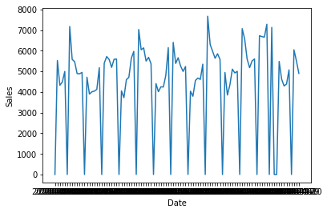
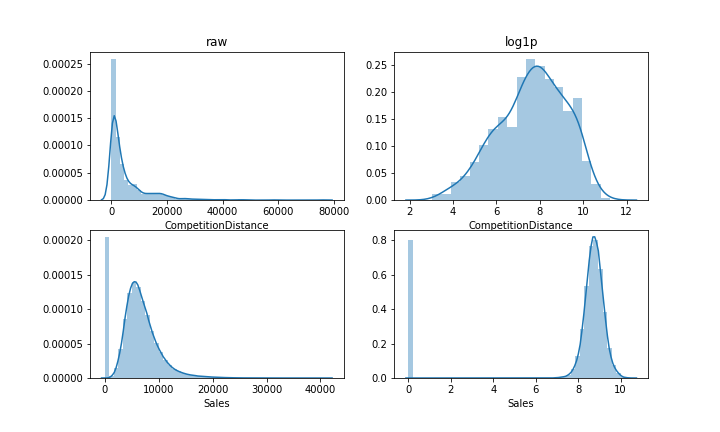
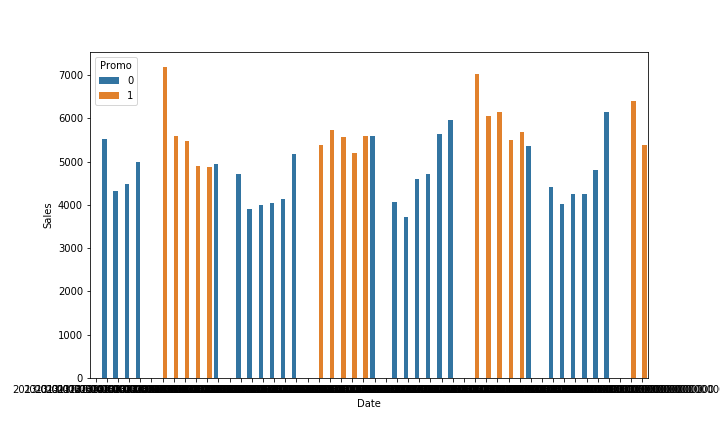

# Rossmann Sales Prediction

机器学习工程纳米学位毕业项目

赵鹏

2018年12月25日

## 1. 定义

### 1.1 项目概述

​	本项目来源于 Rossmann 公司在 Kaggle 上发布的竞赛 Rossmann Store Sales[1]，它的目标是构建一个模型来预测商店的每日销售量。 

​	Rossmann 在全欧洲有超过6000家药店，预测销售额一直是依赖商店经理的直觉经验进行判断，准确率有很大变化。现在我们要帮助 Rossmann 构建一个销售额预测模型，针对位于德国的1115家店，对未来6周的销售额进行预测，对于销售额的预测可以帮助经理们更合理的安排员工上班时间表、销售活动等。


### 1.2 问题说明

​	销售预测是一个经典的回归问题，通过构建一个模型  $\hat{y} = f(X)$ 􏰄 􏰆􏰏􏰐􏰑，使目标变量的预测值 $\hat{y}$ 与真实值 $y$ 之 间的误差最小，这里目标变量 $ y$ 是每日销售量，$X$ 为输入变量，而预测值与真实值之间的误差通过评估标准来评估。 

​	这个问题的难点在于如何利用特征工程从复杂的结构数据中构建输入 $X$。解决回归问题的常用模型有 Linear Regression，SVM，决策回归树，神经网络。 


### 1.3 指标

根据 kaggle 的要求本项目使用指标 RMSPE：

​							$ RMSPE = \sqrt{\frac{1}{n}\Sigma_{i=1}^{n}{\Big(\frac{yi -\hat{yi}}{yi}\Big)^2}}$

$yi$: 真实的销售额

$\hat{yi}$: 预测销售额


由于指标中 $yi$ 不能为零，实际比赛中的评测结果是排除了实际销售额为零的数据。


## 2. 分析

### 2.1 数据研究

本项目的数据集来自 kaggle， 包含了 Rossmann 在德国两年半的的历史销售数据（2013.01.01 ～ 2015-07-31）， 以及店铺的画像数据，具体的内容见下方表格（T1）。


| 数据集    | 内容                                                         | 数据量  | 备注     |
| --------- | ------------------------------------------------------------ | ------- | -------- |
| train.csv | 销售日期、销售额、顾客数量、是否促销，是否营业，是否国家假期，是否学校假期 | 1017209 |          |
| test.csv  | 同上，但去掉了销售额                                         | 41088   | 用于测试 |
| store.cv  | 商店的画像信息，例如商店类型，等级，竞争者信息，促销活动     | 1115    |          |

（T1）


整理三个数据集得出基本特征（T2），可以看出，数据集绝大部分是离散特征，只有需要预测的销售量和顾客数量是连续特征。


| 特征名                    | 特征含义                   | 类型 | 取值              | 备注        |
| :------------------------ | -------------------------- | ---- | ----------------- | ----------- |
| Store                     | Store Id                   | 离散 | 1-1115            |             |
| Sales                     | 日销售额                   | 连续 |                   |             |
| Customers                 | 日顾客数                   | 连续 |                   |             |
| Open                      | 是否营业                   | 离散 | 0,1               |             |
| StateHoliday              | 所在州的节假日             | 离散 | a,b,c,0           |             |
| SchoolHoliday             | 公立学校放假               | 离散 | 0,1               |             |
| StoreType                 | 商店类型                   | 离散 | a,b,c,d           |             |
| Assortment                | 商店评级                   | 离散 | a,b,c             |             |
| CompetitionDistance       | 离最近的竞争者的距离       | 连续 |                   | Na 占 0.3%  |
| CompetitionOpenSinceYear  | 最近的竞争者开业的年份     | 离散 | 年份              | Na 占 31.7% |
| CompetitionOpenSinceMonth | 最近的竞争者开业的月份     | 离散 | 月份              | Na 占 31.7% |
| Promo                     | 当天是否促销               | 离散 | 0,1               |             |
| Promo2                    | 商店是否参与长期促销       | 离散 | 0,1               |             |
| Promo2SinceYear           | 商店参与长期促销开始的年份 | 离散 | 2009-2015         | Na 占 48.8% |
| Promo2SinceWeek           | 商店参与长期促销的周数     | 离散 | 1-50              | Na 占 48.8% |
| PromoInterval             | 长期促销的月份             | 离散 | "Feb,May,Aug,Nov" |             |


（T2）


### 2.2 探索性可视化


#### 2.2.1 数据时间周期性的特征

通过对 train 销售数据按日期排序得出如下数据图（C1）



​									                        (C1)


由数据图表，发现商店存在周日休息的情况，导致销售数据呈现一个周期出现的低谷，另外销售情况也是存在一个周期性的变化规律，周期大约为一周。对此我们应该注意挖掘数据在不同周期上的特征构造，例如周，月，季度等特征的构建。


#### 2.2.2 对于连续变量需要进行 log1p 变换

数据集中两个连续变量，`Sales` 和 `CompetitionDistance`，存在明显的右偏，使用 $x' = log(1 + x)$ [2] 变换使之接近正态分布。（见C2）

使用 $x' = log(1 + x)$， 而非  $x'=log(x)$，是因为考虑到两个变量中存在 0。



(C2)

#### 2.2.3 Promo 促销活动对销售量的刺激存在递减效应

通过可视化数据，发现随着促销活动的进行，销售额的促进作用在减少，考虑构建 `Promo_seq` 来捕捉递减的趋势。（见C3）



(C3)


### 2.3 数据处理和模型

#### 2.3.1 模型选择

由于本次项目存在大量离散型特征，同时参考 Kaggle 大量获奖方案，最终决定选用 GDBT 作为本次项目的模型。

业界中现在流行的 GDBT 实现有个来自微软实验室的 LightGBM[3]，以及陈天奇实现的 Xgboost[4]。

对比之下，Xgboost 最早发布，相关的应用 api 相对成熟，LightGBM 相对较后发布，但由于对叶节点的生成方做了优化（由level-wise改成leaf-wise），LightGBM 运行的效率更快，但模型的精度相对略低一点。（见C4）


(C4) [5]


最终本人选择了使用 XGBoost的结果进行提交，原因如下：

- 比起 LightGBM，XGBoost 总能在本次数据上达到更高的准确度；

- 在 kaggle 提供的 kernels 环境中能 XGBoost 能直接利用 GPU，比起 LightGBM 对 GPU 的支持更为友好


#### 2.3.2 离散变量的处理

本项目中大量存在离散变量，部分存在字符串，目前大部分机器学习模型都需要提前对此类离散变量进行处理。

数据处理过程，我主要使用 Python 中的 Sklearn 工具。


目前主流的离散变量处理方法有：

- **One‐hot 编码**: 此方法是通过生成与类型个数一样的变量数，每个变量代表对应的类别，以`0/1`的方式表示类类别是否存在。 比如性别 sex: M/F，将变成两个变量 sex_M: 0/1, sex_F: 0/1，见下表（T3）。该方法在离散变量的取值不多时比较适合，一旦类型过多，特征空间就会因此膨胀，在样本过少时有可能导致数据稀疏的问题（样本中非零特征远远小于特征总数）。适合使用于Liner regression，SVM等基于几何面划分的模型。

| sex  | -->  | sex_M | sex_F |
| ---- | ---- | ----- | ----- |
| M    | -->  | 1     | 0     |
| F    | -->  | 0     | 1     |

（T3）

- **Label 编码**: 此方法是通过把类型个数转化为唯一对应的整数，见下表（T4）。转化后的 labels 由于是数字会引入一个假设就是类型取值是带有顺序性，所以不适用于回归模型，以及本身类别之间是平行关系（比如人种，职业）

| DayOfWeek | -->  | DayOfWeek_Label |
| --------- | ---- | --------------- |
| Sunday    | -->  | 0               |
| Monday    | -->  | 1               |
| ...       | ...  | ...             |
| Saturday  | -->  | 6               |

（T4）


由于 Store 变量的类别有 1115 个，为了避免数据维度膨胀，我最终选择使用处理是 **Label 编码**。


### 2.4 基准测试

本次项目的基准是最低达到 leaderboard private 的 top 10%, 对于测试集`rmpse`为`0.11773`[6]


## 3. 工作流程

### 3.1 数据预处理

数据预处理主要进行了缺失值补全，log1p变换，**One-hot** encoding。（见T5）

| 数据集     | 变量                | 处理方法                                        | 备注 |
| ---------- | ------------------- | ----------------------------------------------- | ---- |
| store      | 存在缺失值的变量    | NaN 以 0 补全，对比中位数补全最后实验的效果更好 |      |
| train      | Sales               | 使用 $x' = log(1 + x)$ 进行变换                 |      |
| train/test | CompetitionDistance | 使用 $x' = log(1 + x)$ 进行变换                 |      |

（T5）

### 3.2 模型实现

本项目实现了同时使用了 Xgboost， Lightgbm，对同样的特征集进行了预测。

两个模型的训练参数略为不同（见T6），特征集保持一致，但在 xbgoost 中使用 **One-hot 编码 **处理离散变量。train 数据集保留最后 6 周的作为 validation，以别检测模型是否**过拟合**。


| 模型     | 模型参数                                                     | 训练参数                                           |
| -------- | ------------------------------------------------------------ | -------------------------------------------------- |
| Xgboost  | objective = "reg:linear"<br/>booster = "gbtree"
eta = 0.015
max_depth = 10
subsample = 0.9
colsample_bytree = 0.7
seed = 1301 | num_boost_round:6000<br/>early_stopping_rounds:100 |
| Lightgbm | boosting_type = gbdt<br/>objective = mape
max_depth = 15
num_leaves = 81
learning_rate = 0.1
num_thread = 8
subsample = 0.9
bagging_seed = 1307 | num_boost_round:6000<br/>early_stopping_rounds:100 |

(T6)

### 3.3 工作改进

#### 3.3.1 添加 Promo_seq 变量

添加了 **2.2.3** 中提及的``Promo_seq`` 变量，捕捉促销对销售量逐渐减弱的边际效应。(见T7)

| Store | Date       | Promo | Promo_seq | Sales  |
| ----- | ---------- | ----- | --------- | ------ |
| 1     | 2013-01-02 | 0     | 10        | 5530.0 |
| 1     | 2013-01-03 | 0     | 10        | 4327.0 |
| 1     | 2013-01-04 | 0     | 10        | 4486.0 |
| 1     | 2013-01-05 | 0     | 10        | 4997.0 |
| 1     | 2013-01-07 | 1     | 1         | 7176.0 |
| 1     | 2013-01-08 | 1     | 2         | 5580.0 |
| 1     | 2013-01-09 | 1     | 3         | 5471.0 |
| 1     | 2013-01-10 | 1     | 4         | 4892.0 |
| 1     | 2013-01-11 | 1     | 5         | 4881.0 |
| 1     | 2013-01-12 | 0     | 10        | 4952.0 |

（T7）

#### 3.3.2 利用 validation set 调整 test predition

使用 validation 数据对最终提交的 test 数据进行修正。修正原理是对于  `test` 数据集中不同 Store 类型的数据，尝试不同权重(范围[0.990, 1.009], 间距为 0.001)，选取权重 $w$ 使得 $error = \Sigma_{i=1}^{n}{(y - w* \hat{y})}$ 最小。 

修正的算法如下：

```Python
# correction
def correction(y_true, y_predict):
    W = [(0.990 + (i/1000)) for i in range(20)]
    score = []
    for w in W:
        error = rmspe(y_true, y_predict * w)
        score.append(error)
    score = pd.Series(score, index=W)
    best_weight = score[score == score.min()].index
    return best_weight

def correction_by_store(x_hold, x_test):
    store_no = x_hold["Store"].unique()
    
    weight_y_test = np.zeros(len(x_test))
    weight_y_hold = np.zeros(len(x_hold))

    store_weights = {}
    
    for no in store_no:
        df = x_hold[x_hold["Store"] == no]
        y_pred = df.Prediction
        y_true = df.Sales
        
        best_weight = correction(y_true, y_pred)
        store_weights[no] = best_weight
        
        weight_y_test[x_test.Store == no] = best_weight
        weight_y_hold[x_hold.Store == no] = best_weight

    return weight_y_hold, weight_y_test

```


## 4. 结论

### 4.1 模型评估与验证

最终的模型分数见下表（T8），Lightgbm 和 Xgboost 均超出基准 `0.11773`,  总体说 Xgboost 表现更好，但Lightgbm 的训练速度更快，即便 Xgboost 已经使用了 GPU 加速。


| model    | Validation Score | Private Score | Public Score | Train Time          |
| -------- | ---------------- | ------------- | ------------ | ------------------- |
| Lightgbm | 0.108946         | **0.11655**   | 0.11046      | 1271s (without GPU) |
| Xgboost  | 0.114742         | **0.116297**  | 0.11128      | 1619.8s (with GPU)  |

（T8）


### 4.2 预测结果可视化

### 4.3 进一步思考

考虑使用融合模型，本项目只是使用单模型进行预测，根据 kaggle 过往的方案经验，通过 ensemble 多个模型能提高准确度。

另外可以进一步结合本次 kaggle 比赛中第三名方案[7]，利用 entry-embedding 的神经网络模型，把离散变量特征投射到向量空间（类比 word2vec 的词向量空间）。对于存在大量离散特征的数据集，能起到减少特征维度，减轻特征工程工作量，十分简洁优雅。

最后可以收集更多的特征，kaggle 社区还进一步挖掘出每个 Store 对应所在的州份，并给每个样本附上当地的气候数据，相信更多的气候数据能对药房的销售预测提供流行病相关的规律信息。


## 5. 参考文献

- [1] Rossmann Store Sales, [https://www.kaggle.com/c/rossmann‐store‐sales](https://www.kaggle.com/c/rossmann‐store‐sales)
- [2] np.log1p, https://docs.scipy.org/doc/numpy-1.15.1/reference/generated/numpy.log1p.html
- [3] LightGBM, https://lightgbm.readthedocs.io/en/latest/
- [4] XGBoost, https://xgboost.readthedocs.io/en/latest/
- [5] CatBoost vs. Light GBM vs. XGBoost, https://towardsdatascience.com/catboost-vs-light-gbm-vs-xgboost-5f93620723db
- [6] Forecast Rossmann Store Sales, https://github.com/udacity/cn-machine-learning/tree/master/Rossmann_Store_Sales

- [7] Code sharing, 3rd place, category embedding with deep neural network, https://www.kaggle.com/c/rossmann-store-sales/discussion/17974
