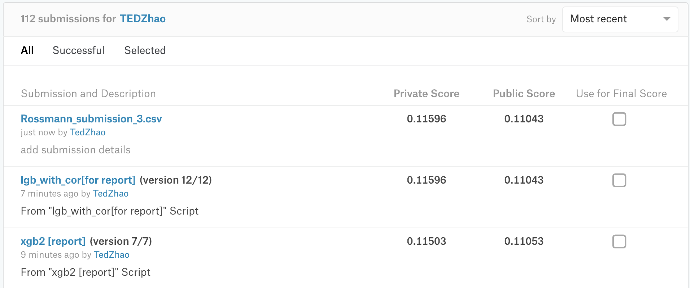

# Rossmann Store Prediction

详细的分析报告参看"report.pdf"

## Python env

- 见本项目下的 requirements.txt

- 主要是使用的框架：
  - Pandas
  - Xgboost

## 项目代码

- xgb-report.ipynb
- lgb-report.ipynb

## 运行时间

| model    | Validation Score | Private Score | Public Score | Train Time          |
| -------- | ---------------- | ------------- | ------------ | ------------------- |
| Lightgbm | 0.108946         | **0.11655**   | 0.11046      | 1271s (without GPU) |
| Xgboost  | 0.114742         | **0.116297**  | 0.11128      | 1619.8s (with GPU)  |

## 运行截图

